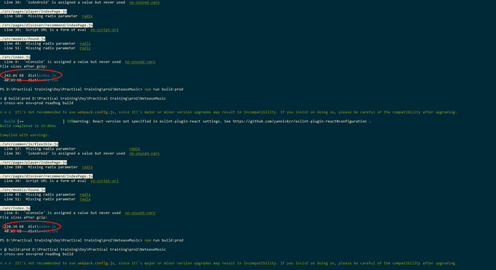

## 某易云音乐
  某易云音乐是一款专注于发现与分享的音乐产品,依托专业音乐人、DJ、好友推荐及社交功能,为用户打造全新的音乐生活。

### 接口地址
- host  http://123.206.55.50:14000


### 开发流程
#### 更新react到16.8.1
  修改package.json中react和react-dom版本号为16.8.1, 然后cnpm install
#### 安装sass-loader
  cnpm i --save-dev node-sass sass-loader
#### 引入antd-mobile

### 多环境构建配置
#### 添加多环境构建命令
```js
  "build": "roadhog build",
  "build:test": "cross-env env=test roadhog build",
  "build:pre": "cross-env env=pre roadhog build",
  "build:prod": "cross-env env=prod roadhog build",
```

#### 如果引入swiper的话，会降低至3.4.2版本
----
#### 下载vconsole移动端调试工具
```
  cnpm install --save vconsole
```
#### 某环境下忽略一些包
  参考地址：[https://github.com/sorrycc/roadhog/issues/304](https://github.com/sorrycc/roadhog/issues/304)

#### 忽略vconsole之后，打包之后文件大小的一些差异
  
